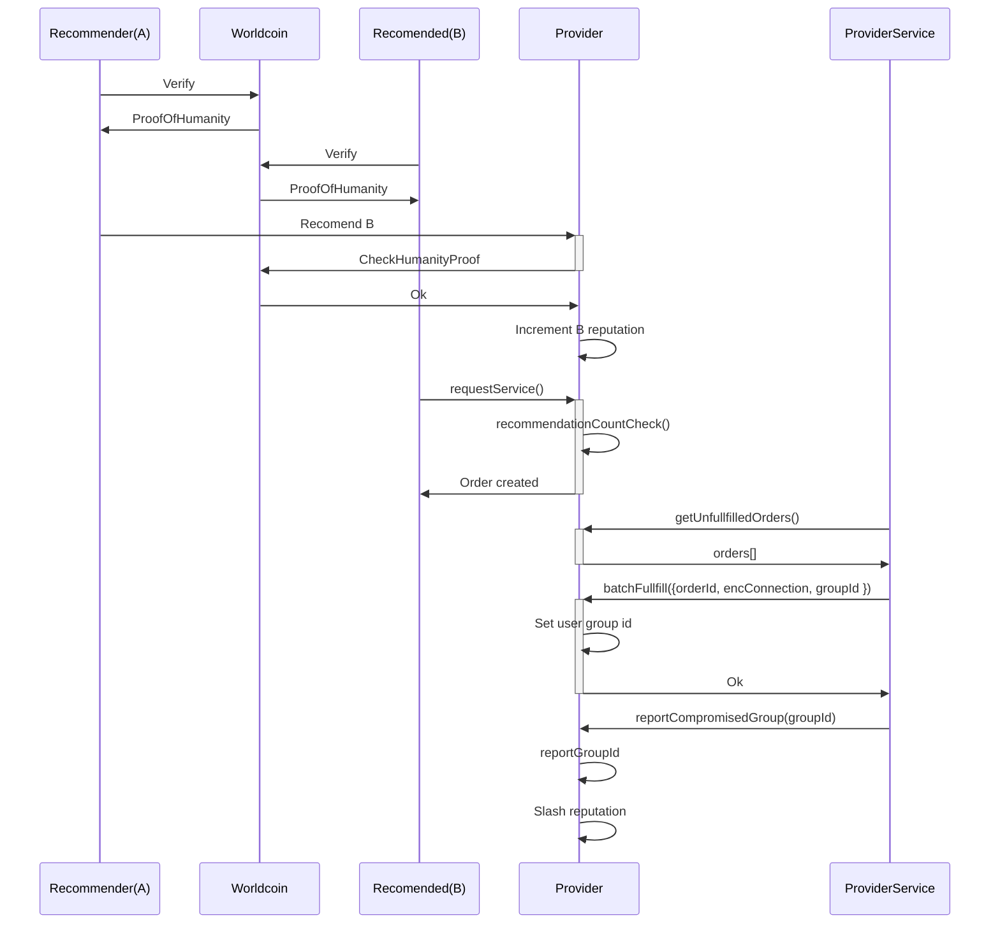

# World Private Network: Decentralized Access to Free Internet

## Overview

**World Private Network** is a censorship-resistant VPN service designed for users in countries with heavy internet restrictions, such as Russia, China, and Turkey. Traditional VPNs are often blocked because their data is easily traceable. Our solution leverages **Worldcoin** for user verification, ensuring that only real, trusted users gain access while maintaining strict privacy and security.

## How It Works

1. **Human Verification**: Users verify their humanity using Worldcoin.
2. **Trust-Based Access**: Verified users can recommend other trusted users.
3. **Reputation System**: Each user accumulates a reputation score based on their activity and endorsements.
4. **Access Purchase**: Once a user reaches a certain reputation threshold, they can buy VPN access for a specific period.
5. **Secure Credentials**: VPN access details are encrypted and provided to the user.
6. **Reputation Slashing**: If credentials are leaked or compromised, the responsible users' reputations are slashed, potentially barring them from future access.

## Why This Matters

- **Censorship Resistance**: A decentralized, trust-based model makes it harder for authorities to block access.
- **Privacy-First**: No centralized control over user data or VPN credentials.
- **Incentive Alignment**: Users are encouraged to maintain security, as their reputation is at stake.
- **Scalable & Trustworthy**: Reputation-based access ensures that only verified, responsible users gain entry.

## Technologies Used

- **Worldcoin**: For user verification and reputation tracking.
- **End-to-End Encryption**: For distributing VPN credentials securely.
- **Smart Contracts**: To manage reputation scores and access control in a decentralized manner.

## Future Roadmap

- Expansion to support **more VPN providers** globally.
- Privacy preserving recommendations, so there's no track onchain of who recommended and who got recommended.
- Develop a decentralized marketplace for VPN providers, allowing multiple providers to participate, grow, and monetize their services while ensuring diversity and resilience against censorship.
